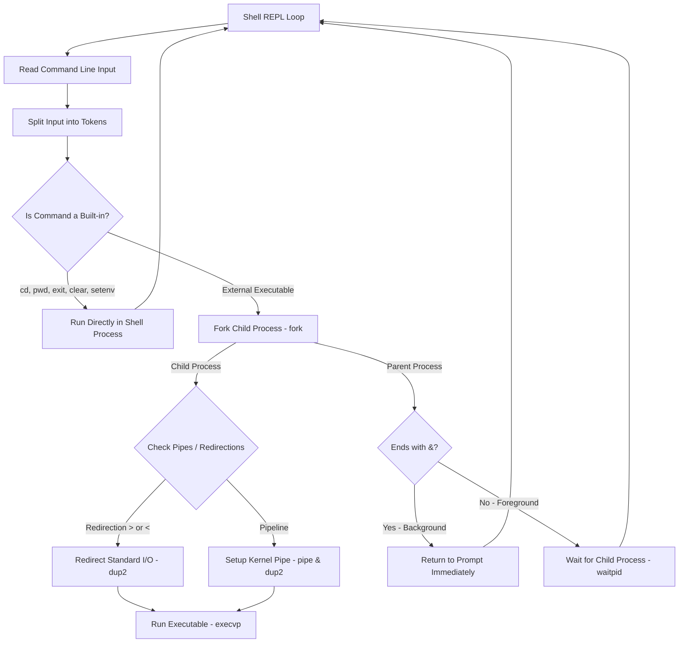

# Simple C Shell

A simple Unix command-line shell written in C using POSIX system calls. The project was built as an educational exercise to learn how operating system concepts work under the hood, including process creation (`fork`), running programs (`execvp`), inter-process communication (`pipe`), file descriptor redirection (`dup2`), and signal handling.

---

## How It Works

The shell runs in a continuous loop: reading user input, parsing command arguments, checking for built-in functions, and spawning child processes to run external programs.



---

## What It Can Do

- Program Execution: Spawns child processes using POSIX system calls (`fork`) and executes external binaries (`execvp`).
- Built-in Commands: Implements core built-in commands directly inside the shell process:
  - `cd`: Change working directory.
  - `pwd`: Print current working directory.
  - `clear`: Clear terminal screen.
  - `exit`: Exit the shell.
  - `setenv` & `unsetenv`: Manage environment variables.
- File Redirection: Supports input (`<`) and output (`>`) redirection using file descriptors and `dup2()`.
- Command Pipelines: Supports running commands connected with pipes (`cmd1 | cmd2`) using `pipe()` and `dup2()`.
- Background Execution: Runs processes in the background when followed by `&`.
- Signal Handling: Handles `Ctrl+C` (`SIGINT`) without terminating the main shell, and catches `SIGCHLD` signals to clean up finished child processes.

---

## Project Files

- `simple-c-shell.c`: Main shell code implementing process initialization, command parsing, pipeline execution, and signal handlers.
- `util.h`: Shared global variables and helper function declarations.
- `Makefile`: Build script to compile the project.
- `COPYING`: GPLv3 license file.

---

## How to Build and Run

### Requirements
- GCC compiler
- Make utility
- Linux, macOS, or WSL

### Compilation
Build the project using `make`:
```bash
make
```
This will compile `simple-c-shell.c` and produce an executable named `simple-c-shell`.

### Running the Shell
Execute the shell binary:
```bash
./simple-c-shell
```

---

## Example Usage

### 1. Running Built-in Commands
```sh
pwd
cd /usr/bin
setenv MY_VAR testing
unsetenv MY_VAR
```

### 2. Output & Input Redirection
```sh
# Save directory listing to a file
ls -la > files.txt

# Read file input into grep
grep "main" < simple-c-shell.c > output.txt
```

### 3. Piping Commands & Background Tasks
```sh
# Pipe output of one command to another
cat /etc/passwd | cut -d: -f1 | sort

# Run a process in the background
sleep 5 &
```

---

## Current Limitations

- Basic Parsing: Does not support complex shell features like conditional execution (`&&`, `||`), wildcards (`*.c`), or nested commands.
- Basic Job Control: Runs background processes with `&`, but lacks commands like `jobs`, `fg`, or `bg` to manage background jobs interactively.
- No Advanced Line Editing: Does not support command history navigation (Up/Down arrow keys) or tab completion.
